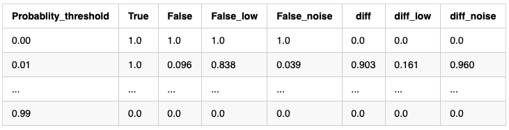

# Hyperparameter optimization

This the last step before we can used our newly trained model to classify peaks from other datasets. In this section, we will not only see how to use the automated method NeatMS provides to optimize the target parameter, but we will also explain the impact this parameter has on the classifier and how we can set it manually.

The last layer of the neural network uses a softmax activation function, which means that the output of the network is a probability distribution of 3 probabilities between 0 and 1, all of them adding up to 1 (3 is number of classes, we have one probability per class). The most simple approach would be to label the peak with the label corresponding to the highest probability returned by the model, but we can also investigate these probabilities and their impact on the prediction. We will particularly focus on the probability that corresponds to the `High quality` class and see how it impacts the prediction of the validation set (which remains untouched so far).

> You can follow the same approach using other classes than `High quality`. However, as `High quality` is the default class used in NeatMS, we will only cover this case here.

Calling the method `get_threshold()` will compute and return the optimal threshold using the validation set that you can then pass everytime you use this neural network. However, this threshold is optimal according to very specific criteria, keep reading to understand how it is computed and learn how to set it manually according to your own criteria.

Internaly, `get_threshold` call the method `get_true_vs_false_positive_df(label='High_quality')` which returns the following table:

*Recall table*

<!--| Probablity_threshold | True    | False    | False_low | False_noise | diff     | diff_low | diff_noise |
|----------------------|---------|----------|-----------|-------------|----------|----------|------------|
| 0.00                 | 1.0 | 1.0 | 1.0  | 1.0    | 0.0 | 0.0 | 0.0   |
| 0.01                 | 1.0 | 0.096 | 0.838  | 0.039    | 0.903 | 0.161 | 0.960   |
| ...                  | ...     | ...      | ...       | ...         | ...      | ...      | ...        |
| 0.99                 | 0.0 | 0.0 | 0.0  | 0.0    | 0.0 | 0.0 | 0.0   |-->

Using this table, you can decide on the threshold value that you would like to use.

More tools and tips such as how to creating ROC curves to assist you in the choice of the right threshold value is coming soon.
