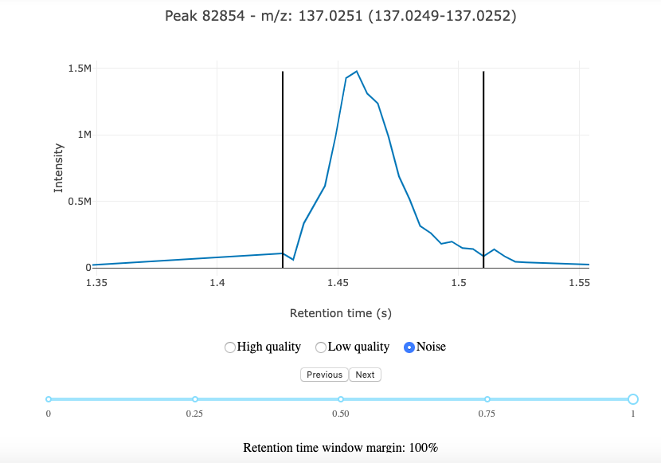

# Training set creation

## Sample selection

For optimal training, we recommend to use a representative subset of the dataset that your are planning to analyse, or as similar as possible. Using the same sample type (plasma, tissue, cells...), same sample preparation (i.e. extraction protocol), same instrumentation (LC column, MS...) for training the neural network as the ones used for the data we whish to analyse will allow us to have a more specific and more accurate model. 

Ideally, select pooled samples as they should contain a wide variety of peaks, and avoid using blank samples. Using a substet of a dataset is prefereable because all peaks need to extracted from the raw data before we can labelled them, and this can take some time (~15 seconds per samples). Using 200 samples would just take longer to load and use unnecessary memory space. A selection of 10 to 20 samples is enough. Just make sure to to remove all unnecssary columns from the feature table files as well as adjusting the coontent of your raw data folder.

## Annotation (labelling) tool

Before launching the tool and start labelling peaks, we need to create our experiment object and load the data, we can do that the exact same way as we have done before.

``` python
raw_data_folder_path = 'path/to/raw_data/folder'
feature_table_path = 'path/to/feature_table'
title = 'MyFirstExperiment'

experiment = Experiment(raw_data_folder_path, title, feature_table_path, load_MS1=True)
```

We are now ready to launch the annotation tool!

First we will create an instance of the class `AnnotationTool`, passing as argument the experiment object that we just created. Then, we call the only method available in this class to start the tool.

``` python
annotation_tool = AnnotationTool(experiment)
annotation_tool.launch_annotation_tool()
```

You should see a tool similar to the one below appearing below the cell in the Jupyter notebook.


*NeatMS annotation tool*

The interface is very simple, allowing you to choose the label you want to assign to the peak, and a slider to see more or less of the signal surrounding the peak.

Peaks are randomly selected, and stay accessible through the `Previous` button.

## Annotation tool - Review mode

Consistently labeling hundreds, maybe thousands of peaks is not necessarily simple. We can make obviously make mistakes, but our interpretation of the peaks can change as we label them. A type of peak that was considered `High quality` can slowly change into a `Low quality` as we go along, even with highest possible attention, it will most certainly happen. As you can imagine, this can be a problem as we want to avoid providing conflicting data to train our neural network. So one good practice to have is to review at least once (every few hundreds of peaks is even better) the peaks we have been labelling. 

Peaks can be reviewed altogether or by specific label, reviewing one label at a time helps making consistent decision.

To enter the review mode, simply add a list containing the labels you want to review as a keyword argument when creating the `AnnotationTool` object.

``` python
# Options are ['High_quality','Low_quality','Noise']
annotation_tool = AnnotationTool(experiment, review=['High_quality'])
annotation_tool.launch_annotation_tool()
``` 

Once all peaks from the specified labels have been reviewed, the tool automatically goes back to its default mode and will give you randommely selected peaks to label.
